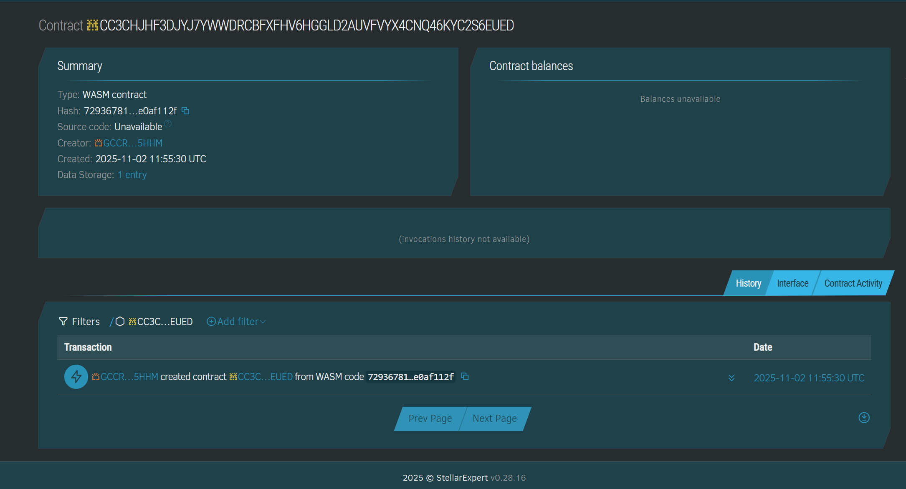

# KYC Attestation Contract (Soroban)

This repository contains a reusable KYC attestation smart contract for Soroban (Stellar) written in Rust.

## 🎉 **DEPLOYED ON TESTNET**

**Contract ID:** `CC3CHJHF3DJYJ7YWWDRCBFXFHV6HGGLD2AUVFVYX4CNQ46KYC2S6EUED`  
**Contract Alias:** `kyc_attestation`  
**Explorer:** [View on Stellar Expert](https://stellar.expert/explorer/testnet/contract/CC3CHJHF3DJYJ7YWWDRCBFXFHV6HGGLD2AUVFVYX4CNQ46KYC2S6EUED)

### 📸 Live Contract Verification on Stellar Expert



📄 See [DEPLOYMENT.md](DEPLOYMENT.md) for complete deployment details and verification info.

## Key properties
- Admin initializes the contract and manages a whitelist of KYC issuers.
- Issuers can issue and revoke attestations for subjects (users).
- Only 32-byte hashes (pointers) to off-chain PII are stored — no PII on-chain.
- Subjects control visibility: public or allow specific verifiers.
- Verifiers can call `verify_kyc(subject)` to check whether that subject has a valid attestation.

Directory structure

- Cargo.toml — crate configuration and dependencies
- src/lib.rs — Soroban contract implementation
- scripts/* — PowerShell helpers and examples
- README.md — this file

Build & deploy (PowerShell examples)

1) Build

```powershell
soroban contract build
```

2) Deploy to testnet

```powershell
soroban contract deploy --network testnet --wasm target/wasm32-unknown-unknown/release/kyc-attestation.wasm
```

The deploy command prints the contract ID. Copy it for the next steps.

3) Initialize contract (callable once)

```powershell
# Replace <CONTRACT_ID> and <ADMIN_ADDRESS>
# The admin must sign this transaction
soroban contract invoke --network testnet --id <CONTRACT_ID> --source <ADMIN_IDENTITY> --fn initialize --arg <ADMIN_ADDRESS>
```

4) Add an issuer (admin only)

```powershell
# Replace <ISSUER_ADDRESS>
# The admin must sign this transaction
soroban contract invoke --network testnet --id <CONTRACT_ID> --source <ADMIN_IDENTITY> --fn add_issuer --arg <ISSUER_ADDRESS>
```

5) Issue KYC (by an issuer)

```powershell
# Replace <ISSUER_ADDRESS>, <SUBJECT_ADDRESS>, <32_byte_hash> and <public_bool (true|false)>
# The issuer must sign this transaction
soroban contract invoke --network testnet --id <CONTRACT_ID> --source <ISSUER_IDENTITY> --fn issue_kyc --arg <ISSUER_ADDRESS> --arg <SUBJECT_ADDRESS> --arg <32_byte_hash> --arg true
```

6) Revoke KYC (by issuer)

```powershell
# The issuer must sign this transaction
soroban contract invoke --network testnet --id <CONTRACT_ID> --source <ISSUER_IDENTITY> --fn revoke_kyc --arg <ISSUER_ADDRESS> --arg <SUBJECT_ADDRESS>
```

7) Subject sets visibility (subject only)

```powershell
# Subject can make an attestation public or private
# The subject must sign this transaction
soroban contract invoke --network testnet --id <CONTRACT_ID> --source <SUBJECT_IDENTITY> --fn set_public --arg <SUBJECT_ADDRESS> --arg <ISSUER_ADDRESS> --arg true
```

8) Subject allows specific verifier (subject only)

```powershell
# The subject must sign this transaction
soroban contract invoke --network testnet --id <CONTRACT_ID> --source <SUBJECT_IDENTITY> --fn allow_verifier --arg <SUBJECT_ADDRESS> --arg <ISSUER_ADDRESS> --arg <VERIFIER_ADDRESS> --arg true
```

9) Verifier checks KYC

```powershell
# The verifier must sign this transaction
soroban contract invoke --network testnet --id <CONTRACT_ID> --source <VERIFIER_IDENTITY> --fn verify_kyc --arg <VERIFIER_ADDRESS> --arg <SUBJECT_ADDRESS>
```

Notes and design choices
- No PII is stored on-chain. The contract only stores 32-byte hashes (BytesN<32>) that should point to off-chain encrypted KYC records.
- The contract uses a simple indexing scheme: when an issuer issues an attestation for a subject, the issuer's address is appended to a stored list for that subject. This allows `verify_kyc` to scan the issuers for that subject and find valid attestations.
- Authorization uses Soroban's `require_auth()` pattern (v21+) instead of checking invoker manually. Each sensitive function requires the appropriate party to sign.
- Storage uses typed `DataKey` enum with instance storage for persistence.
- Built and tested with soroban-sdk 21.7.1 and Soroban CLI 23.1.4.

API Changes from initial design
- Functions now explicitly take the authorizing address as the first parameter (e.g., `issue_kyc(issuer, subject, ...)` instead of implicitly using `env.invoker()`).
- This follows Soroban best practices for clear authorization patterns.

Next steps / improvements
- Add unit tests (using soroban-sdk testutils).
- Add pagination or stronger indexing if subject issuer lists grow large.
- Add expiry timestamps and on-chain revocation reasons if needed.
- Consider persistent storage for critical data and temporary/instance for less critical data.
